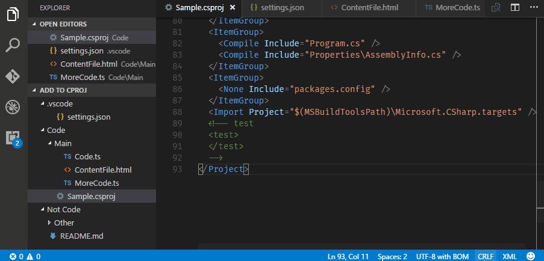
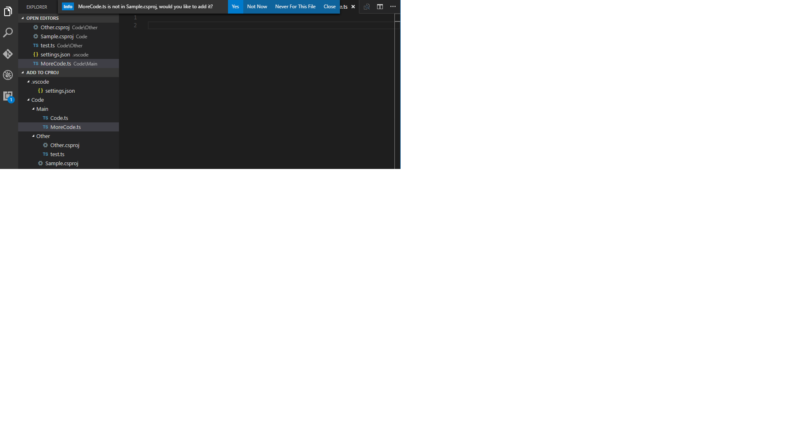
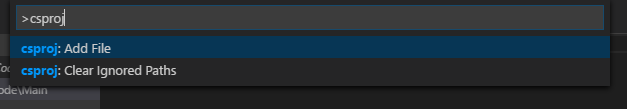
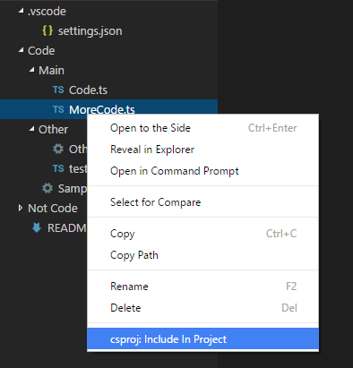

# VS Code `.csproj` Extension

This extension will prompt you to add files to the .csproj file used by Visual Studio. This is useful if you work in a team that uses both VS Code and Visual Studio.

## Demo



## How it Works

When you switch to or save a file not in the nearest `.csproj` up the file system tree, you will prompted.



Choosing "Close" will add an item to the status bar and stop asking you while you have the file open.


You can add a file to csproj via the command palette:



Or via the context menu in the file explorer:



## Extension Settings

This extension contributes the following settings:

* `csproj.enable`: Enable/disable this extension.
* `csproj.itemType`: Mapping from file extension to csproj XML element. Defaults to:
    ```json
    { "*": "Content",
      ".ts": "TypeScriptCompile" }
    ```

* `csproj.silentDeletion`: Silently delete items from csproj when their corresponding files are removed. Default: `false`.
* `csproj.includeRegex`: Regular expression to match files you want to add to csproj.
* `csproj.excludeRegex`: Regular expression to exclude files you do not want to add to csproj.

    If a file matches `includeRegex` *and* `excludeRegex`, it will be excluded.

The regular expressions will prevent this extension from prompting for action, but it intentionally will not
prevent you from adding via the command palette or a context menu.

## Release Notes

### 0.6.1

Improvements:

* When adding a directory to csproj, respect the `files.exclude` configuration as well as the existing
  `csproj.includeRegex` and `csproj.excludeRegex`. In other words, files not within your worspace will not be added.

### 0.6.0

* Deletion support. Watches for file deletions, and adds "Remove from Project" to the context menu.
* Directory support.
  - Selecting "Include in Project" on a directory will add all files that match the config to csproj.
  - Selecting "Remove from Project" will remove all files within the directory from the relevany csproj file(s).

### 0.5.0

Features:

* Item type is now configurable based on file extension.

### 0.4.2

Improvements:

* Use forked version of elementtree for XML parsing. Solution is safer and faster.
* XML attributes are no longer sorted lexographically.

### 0.4.1

Fixes:

* Output XML much more like Visual Studio.
  - Use CLRF
  - Format comments in the same way

### 0.4.0

Features:

* Switch from quick picker to information message with options.

### 0.3.0

Features:

* Detect changes to csproj and lazily reload into cache.
* Add files to the last `ItemGroup` in csproj, or create one if there are none.

Fixes:

* Fix handling of comments in csproj. (Preserve them.)
* Fix incorrect indentation detection in some cases. Hard-code to two-spaces.

### 0.2.1

Fixes:

* Fix configuration for editor context menu.

### 0.2.0

Features:

* Context menu item in file explorer.
* `includeRegex` and `excludeRegex`.

### 0.1.2

Fixes:

* Fix configuration autocompletion in settings files.

### 0.1.1

Fixes:

* Fix a caching bug when using multiple csproj files.

### 0.1.0

Features:

* Support enable/disable configuration.
* Support custom item types. (Global setting only)

### 0.0.1

Initial release.

Features:

* Support adding to nearest csproj by walking up the file system tree from current file.
* Status bar item for items temporarily ignored from csproj.
* Persistent ignore list for items not to be added to csproj.
* Caching to prevent excessive csproj reads.
