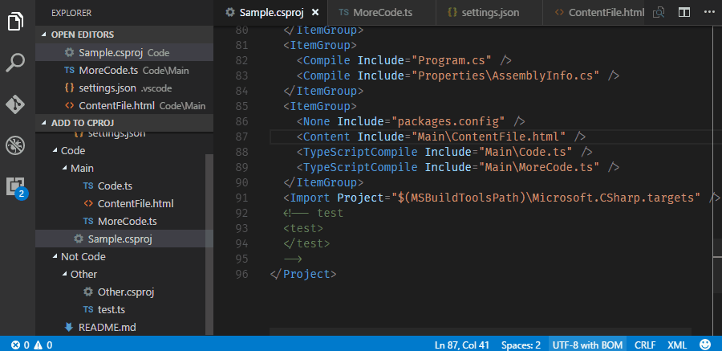
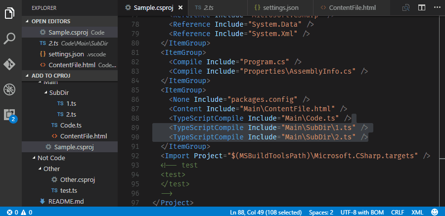

# VS Code `.csproj` Extension

This extension will helps you keep your csproj files in sync when using VS Code.
This is useful if you work in a team that uses both VS Code and Visual Studio.

## Demo

### Adding Files to a Project

### Removing Files from a Project

| **Single File Deletion**  | **Multiple File Deletion**
|---------------------------|--------------------------------
|  | 

## How it Works

When you switch to or save a file not in the nearest `.csproj` up the file system tree, you will prompted.

Choosing "Close" will add an item to the status bar and stop asking you while you have the file open.

| **File Not in csproj** | **File Contained in csproj**
|------------------------|------------------------------
|  | 

You can add a file to csproj via the command palette:

Or via the context menu in the file explorer:

## Extension Settings

This extension contributes the following settings:

| **Setting Key**         | **Description**
|-------------------------|-----------------
| `csproj.enable`         | Enable/disable this extension.
| `csproj.itemType`       | Mapping from file extension to csproj XML element. Defaults to:   `{ "*": "Content", ".ts": "TypeScriptCompile" }`
| `csproj.silentDeletion` | Silently delete items from csproj when their corresponding files are removed. Default: `false`.
| `csproj.includeRegex`   | Regular expression to match files you want to add to csproj.
| `csproj.excludeRegex`   | Regular expression to exclude files you do not want to add to csproj.

These regular expressions will prevent unwanted prompts. If a file matches `includeRegex` *and* `excludeRegex`, it will be excluded.

The regular expressions will prevent this extension from prompting for action, but it intentionally will not
prevent you from adding via the command palette or a context menu. _However_, if you click "Include in Project" on
a directory, `files.exclude`, your saved ignore list, `csproj.includeRegex` and `csproj.excludeRegex` will be honored.

## Links

* [GitHub Repository](https://github.com/DerFlatulator/vscode-csproj)
* [Marketplace Entry](https://marketplace.visualstudio.com/items?itemName=lucasazzola.vscode-csproj)

## Release Notes

### Most Recent Release (0.6.6)

Fixes:

* Fix an issue [#7](https://github.com/DerFlatulator/vscode-csproj/issues/7) where adding a directory does not traverse deeply to find files.

### See GitHub for [full release history](https://github.com/DerFlatulator/vscode-csproj/releases)

## License

MIT
